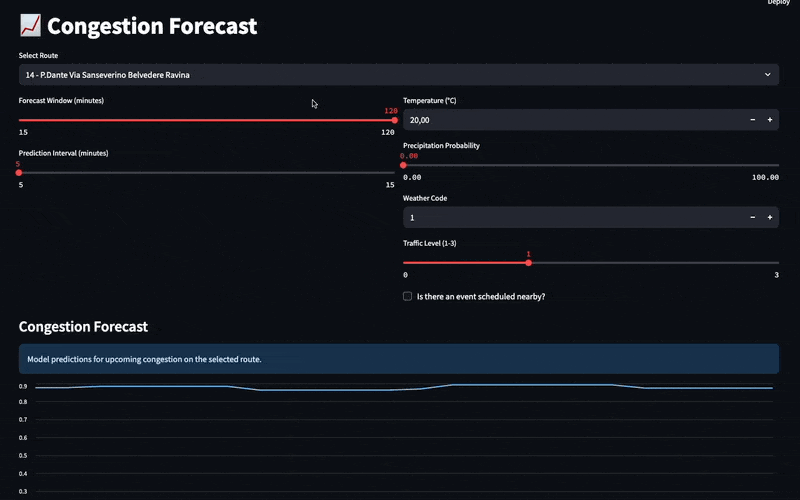
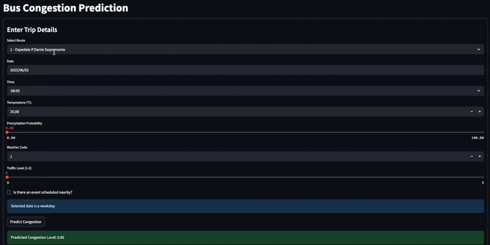
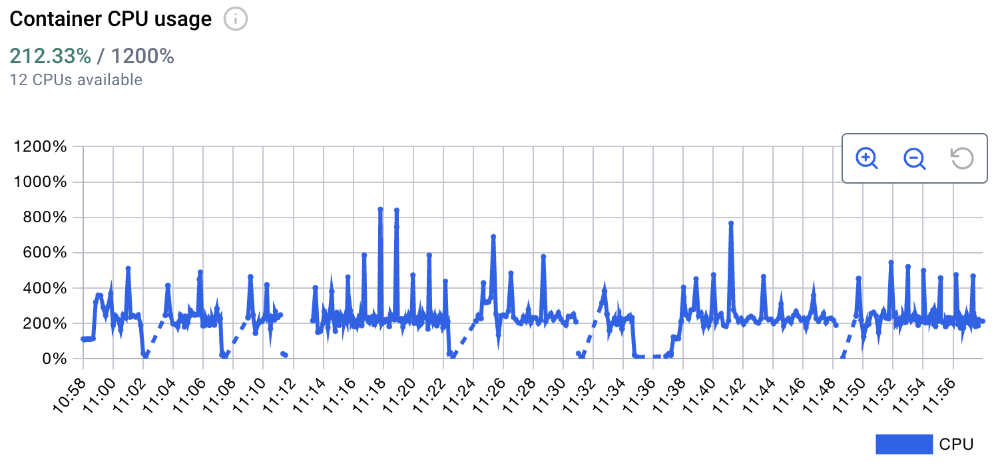
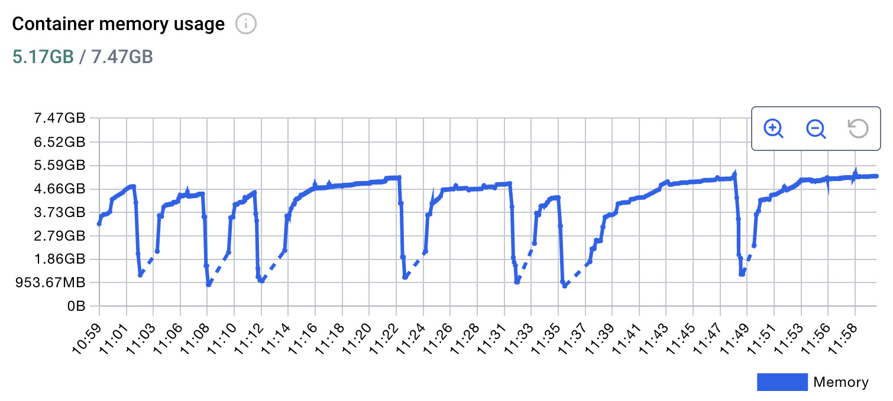

# Real-Time Congestion Tracking for Public Transportation

Welcome to the repository for the Big Data Technologies Project! In this project our team tried to develop a scalable big data application with real-time functionalities. The objective was to provide authorities with the tools necessary to understand how to improve the allocation of buses based on the real-time and predicted demand for public transporation along multiple routes.

# Running the app locally

The first step to run the app locally is to clone the main branch of the GitHub repo locally on your machine by running the following command from the terminal:

```bash
git clone https://github.com/tricarico672/BDTProject.git
```

To run the app locally make sure that you have an active instance of Docker with its daemon running in the background and navigate to the directory where you downloaded the repo locally. Once inside the repo you now have to make the following choice before moving on with starting the program: do I want to use real traffic data provided by Google Maps or do I want to use synthetic traffic data?

## In case your answer is "Yes"

You should get a Google Maps API Key to use with the Distance Matrix API. Follow the official documentation to get one: https://developers.google.com/maps/documentation/distance-matrix/get-api-key

Then, from the root of the directory run:

```bash
python src/guided_setup.py
```

this will set up the required API keys as environment variables in the scripts that use those.

## In case your answer is "No"

No further action is required from you at this point and you can move on to the next section.

## Building the app

You can now proceed to building the app. To do that simply run from the root of the repo in a terminal instance:

```bash
docker compose up --build -d
```

This will build the project and start up all its components.

## Closing the app

To stop the app and remove its components run from the root of the repo in a terminal instance:

```bash
docker compose down -v
```

This will ensure the correct removal of all volumes and make sure that whenever the app is started again it starts from a clean state.

## Accessing the Streamlit Dashboard

After the project has been built you can then visualize the main Streamlit dashboard by connecting to `http://localhost:8501`. It is recommended to wait a few minutes for all components to initialize correctly before beginning to use the dashboard interactively. You can check out more detailed information about the dashboard by reading its dedicated `README.md` file located in the `streamlit` directory.

### Quick Streamlit Tour

If you can't wait for the app to build and in the meanwhile you want to learn more about the dashboard this section will showcase the main functionalities of the dashboard.

#### Bus Map

<p align="center">
  
</p>

#### Analytics

<p align="center">
  
</p>

#### Forecasts

<p align="center">
  
</p>

#### Predictions

<p align="center">
  
</p>

# Common Issues and Troubleshooting

This section outlines the most common issues found when testing the program along with some easy ways to fix them.

## 1. Error reading from .env files

In some test runs we experienced an error related to the following lines in the `docker-compose.yml` file:

```yml
env_file:
    - path: ./kafka-components/kafka-producer-passengers/.env
    required: false
```

To solve this error it was sufficient to make sure that we were running the latest version available of Docker Desktop (v4.41.2) and the Docker Engine (v28.1.1) since the feature making `.env` files optional using the `required` field was introduced in Docker Compose version 2.24.0 as detailed in the official [Documentation](https://docs.docker.com/compose/how-tos/environment-variables/set-environment-variables/).

## CPU Overload

In our testing we noticed that at times, due to the speed at which data is generated and shared across components, the load on the CPU would get too high leading some processes to quit unexpectedly and containers to crash at times. To stabilize this problem we introduced an environment variable called `SLEEP` which makes sure that the data is generated after waiting a constant number of seconds (or fraction thereof) thus artificially slowing down the data generation process.

We made sure to include this as an environment variable so that people testing the app on different machines with different hardware can still manage to run the app. You can change the speed of the data generation by locating the following snippet of code in the `docker-compose.yml` file:

```yml
kafka-producer-passengers:
  build:
    context: ./kafka-components
    dockerfile: ./kafka-producer-passengers/Dockerfile
  env_file:
    - path: ./kafka-components/kafka-producer-passengers/.env
      required: false
  depends_on:
    - kafka
    - db
  environment:
    - SLEEP=0.05
```

and changing the value associated to `SLEEP` (lower values = faster data generation + higher CPU load, and viceversa).

Below we report CPU and memory usage metrics relative to a `SLEEP` parameter of 0.05.




# Additional Information about the Current Implementation

This section contains additional information as to how we reached the current implementation and the data that is being used in the app. To learn more details about the way individual components work in the program and the tasks they carry out, please read the `README.md` file contained in each service's directory.

## Data

The data that served as the starting point for the project was downloaded from the official website of [Trentino Trasporti](https://www.trentinotrasporti.it/open-data). The data was provided under the context of Open-Data and therefore was free to use. This data is available in the `data/trentino_trasporti` directory.

## Data Generation with LLMs

Using the structure provided by the data from Trentino Trasporti, and after having aggregated the data in a single .csv file, we then prompted ChatGPT to generate more examples of such data by using the following prompt:

### Prompt

I need to generate prediction data according to the data from Trentino Trasporti contained in the following .csv file and the following specifications:

1. I want to simulate tickets validated at each stop for each route (accessible from the `stop_id` field and the `route_short_name` present in the .csv file).
2. The data needs to be in .csv format with each estimation that you make being added as another column called passengers. Times are available in the `departure_time` field.
3. Make sure that the data generated is realistic. This means take into account that more tickets will be validated during peak hours such as school time and when people go in and out of their jobs. Also, add a column with a binary (0-1) output called `peak_hour` to make sure that a value of 1 is assigned when the `departure_time` is either between `07:00:00` and `09:00:00` or between `16:00:00` and `18:00:00`.
4. The minimum number of passengers waiting at the stop is 0 and the maximum number is 30.
5. Add a column telling how many passengers are getting out of the bus (`passengers_out`).
6. Add three columns showing the forecasted weather temperature (in degree Celsius) rounded to 1 decimal point, `precipitation probability`, and `weather_code` where `weather_code` is one of the standard codes used by WMO as shown in the table available at this [link](https://www.nodc.noaa.gov/archive/arc0021/0002199/1.1/data/0-data/HTML/WMO-CODE/WMO4677.HTM). This should be consistent with the precipitation probability and temperature picked! Make it so that ridership increases on cold or rainy days.
7. Add a column representing the traffic condition. Use the following categories to categorize traffic conditions:

   1. `no traffic/low`: Up to 10% additional travel time.
   2. `medium`: Up to 30% additional travel time.
   3. `heavy`: Travel time is doubled.
   4. `severe/standstill`: Travel time is more than doubled.

   Remember that this traffic condition should be shared across the same individual `trip_ids` since each different `trip_id` covers a different `route` at a different time.

8. Add a column representing the presence of an event on the line (0 = no event, 1 = event). The same `trip_ids` on one specific day should share the same value. However, be careful to place events at a time of the day when it is plausible to have one (i.e., do not place any event happening late at night or very early in the morning)
9. Make sure that the data generated is realistic. This means take into account that more tickets will be validated to reach schools and hospitals (this information is accessible from the school and hospital fields where 1 indicates the presence of a school or hospital on the route). Also do not change any fields that have been given to you, meaning do not change any of the data that is already in the file, just add the new columns as instructed so far.
10. Possibly, include as much weather variation as possible but be mindful not to include two completely different forecasts for timestamps that are closer together in time.
11. Finally, produce a second dataset similar to the first one. However, I would like the first one to be only for weekdays (so it should have a 0 in the weekend column) while the second one should have a 1 in the weekend column. This will help me generalize also for trips happening during weekends. This dataset will have to follow the same rules and should contain the same exact columns as the first one. However, make sure that during weekends less people use transportation in the morning (unless there is an event) and more people use transportation in the afternoon and evening. Also, on weekends there is no school or work so adjust your generated predictions accordingly.
