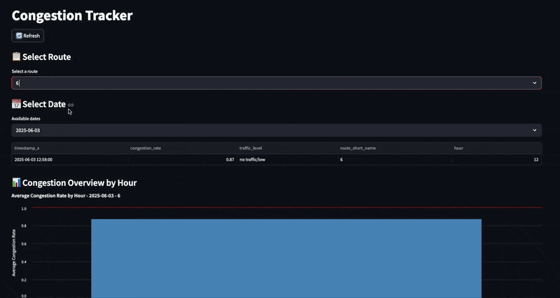

# Real-Time Congestion Tracking for Public Transportation


Welcome to the repository for the Big Data Technologies Project! In this project our team tried to develop a scalable big data application with real-time functionalities. The objective was to provide transit authorities with the tools necessary to understand how to improve the allocation of buses based on the real-time and predicted demand for public transportation along multiple routes.

# Tech Stack

The project utilizes a diverse set of modern technologies to handle different aspects of the application. Below is a comprehensive overview of the tech stack:

| Technology   | Role/Purpose                                                                                |
| ------------ | ------------------------------------------------------------------------------------------- |
| Python       | Primary programming language used across all components                                     |
| FastAPI      | REST API development for various microservices (prediction service, sensors consumer, etc.) |
| Streamlit    | Frontend dashboard development and data visualization                                       |
| Apache Kafka | Message broker for real-time data streaming between components                              |
| Apache Spark | Distributed data processing and streaming analytics                                         |
| PostgreSQL   | Primary database for storing processed data and analytics                                   |
| MongoDB      | NoSQL database for storing raw data                                                         |
| MinIO        | Object storage for ML models                                                                |
| XGBoost      | Machine learning model implementation for congestion prediction                             |
| Docker       | Containerization and orchestration of all services                                          |
| Altair       | Interactive data visualization in the dashboard                                             |
| PyDeck       | Geospatial data visualization                                                               |
| SQLAlchemy   | SQL toolkit and ORM for database operations                                                 |
| MLflow       | ML model lifecycle management and metrics storage                                           |
| Scikit-learn | Machine learning utilities and preprocessing                                                |
| Uvicorn      | ASGI server for FastAPI applications                                                        |
| Dask         | Parallel computing and large dataset handling                                               |
| Boto3        | AWS SDK for Python, used with MinIO                                                         |
| Redis        | In-memory data store for API rate limiting in traffic data collection                       |

Each technology was chosen for its specific strengths and ability to handle different aspects of the real-time data processing pipeline, from data ingestion to visualization.

# Project Structure

```
./
├── data/                      # Data storage directory
├── kafka-components/          # Kafka producers and consumers
│   ├── kafka-consumer-gps/
│   ├── kafka-consumer-model/
│   ├── kafka-consumer-passengers/
│   ├── kafka-consumer-sensors/
│   ├── kafka-consumer-tickets/
│   ├── kafka-consumer-traffic/
│   ├── kafka-consumer-weather/
│   ├── kafka-producer-gps/
│   ├── kafka-producer-passengers/
│   ├── kafka-producer-sensors/
│   ├── kafka-producer-tickets/
│   ├── kafka-producer-traffic/
│   ├── kafka-producer-weather/
│   └── utils/                 # Shared Kafka utilities
├── ml-model/                  # Machine learning model files
├── mlflow/                    # MLflow tracking server
├── mong/                      # MongoDB configuration
├── notebooks/                 # Development and testing notebooks
│   └── utils/                # Notebook utilities
├── postgresql/               # PostgreSQL configuration
├── prediction-service/       # Real-time prediction API
├── spark-components/         # Spark processing modules
├── src/                      # Source code utilities
├── streamlit/               # Dashboard application
│   ├── .streamlit/          # Streamlit configuration
│   ├── images/              # Dashboard images
│   ├── modules/             # Dashboard modules
│   ├── main.py             # Main dashboard entry
│   ├── page1.py            # Dashboard pages
│   ├── page2.py
│   ├── page3.py
│   ├── page4.py
│   ├── page5.py
│   ├── page6.py
│   └── manager.py          # Dashboard state management
├── docker-compose.yml      # Container orchestration
├── .gitignore             # Git ignore rules
└── README.md              # Project documentation
```

### Component Description

#### Core Application Components

- **streamlit/**: Interactive dashboard application for visualizing bus congestion data
- **kafka-components/**: Message brokers and processors for real-time data streaming
- **ml-model/**: Machine learning model components for congestion prediction
- **prediction-service/**: Real-time prediction API service
- **mlflow/**: Model tracking, versioning, and experiment management

#### Data Management

- **postgresql/**: Main database configuration and schemas
- **mong/**: MongoDB configuration for specific data types
- **data/**: Data storage and management
- **notebooks/**: Development and testing notebooks (not used in production)

#### Processing Components

- **spark-components/**: Spark processing modules for data transformation

#### Configuration and Setup

- **src/**: Source code utilities and helper functions
- **docker-compose.yml**: Container orchestration and service configuration
- **.gitignore**: Git ignore rules for version control
- **README.md**: Project documentation and setup instructions

This structure represents a microservices architecture focused on real-time data processing and analysis, with separate components for data ingestion, processing, storage, and visualization.

# Getting Started

The first step to run the app locally is to clone the main branch of the GitHub repo locally on your machine by running the following command from the terminal:

```bash
git clone https://github.com/tricarico672/BDTProject.git
```

To run the app locally make sure that you have an active instance of Docker with its daemon running in the background and navigate to the directory where you downloaded the repo locally. Once inside the repo you now have to answer the following question before moving on with starting the program: do I want to use real traffic data provided by Google Maps?

## In case your answer is "Yes"

You should get a Google Maps API Key to use with the Distance Matrix API. Follow the official documentation to get one: https://developers.google.com/maps/documentation/distance-matrix/get-api-key

Then, from the root of the directory run:

```bash
python src/guided_setup.py
```

this will set up the required API keys as environment variables in the scripts that use those.

## In case your answer is "No"

No further action is required from you at this point and you can move on to the next section and the app will take care of generating synthetic traffic data.

## Building the app

You can now proceed to building the app. To do that simply run from the root of the repo in a terminal instance:

```bash
docker compose up --build -d
```

This will build the project and start up all its components.

## Closing the app

To stop the app and remove its components run from the root of the repo in a terminal instance:

```bash
docker compose down -v
```

This will ensure the correct removal of all volumes and make sure that whenever the app is started again it starts from a clean state.

## Accessing the Streamlit Dashboard

After the project has been built you can then visualize the main Streamlit dashboard by connecting to `http://localhost:8501`. It is recommended to wait a few minutes for all components to initialize correctly before beginning to use the dashboard interactively. You can check out more detailed information about the dashboard by reading its dedicated `README.md` file located in the `streamlit` directory. For a seamless experience, we recommend using Google Chrome as the browser to visualize the dashboard correctly.

### Quick Streamlit Tour

If you can't wait for the app to build and in the meanwhile you want to learn more about the dashboard this section will showcase the main functionalities of the dashboard.

#### Congestion Tracker

<p align="center">
  
</p>

This page allows to visualize the results from real-time recorded congestion on buses and guides authorities in the allocation of buses on different routes. The decision process is automated as much as possible by providing automated suggestions on how many buses to add to each route based on the congestion level recorded.

#### Bus Map

<p align="center">
  
</p>

This component is experimental. In the current implementation, it allows to visualize the route travelled by each bus. It offers a convenient dropdown menu that allows for the selection of a specific route to visualize.

#### Analytics

<p align="center">
  
</p>

This page allows to visualize how many passengers are getting on and off buses and offers the possibility to filter aggregated results by route and by stop if needed.

#### Forecasts

<p align="center">
  
</p>

This page allows to visualize forecasts for a specific route as different parameters are varied. For instance, it is possible to set a different temperature, change the probability of precipitation or change the weather code representing the weather conditions.

#### Anomalies

<p align="center">
  
</p>

This page shows the main bottlenecks caused by traffic on each different route.

#### Predictions

<p align="center">
  
</p>

This page allows to exploit the trained model to see its outputs as different parameters are varied. It offers more flexibility compared to the forecasts page as it also allows for the arbitrary selection of any time of the day.

**DISCLAIMER**: we are aware of the current limitations of the model as sometimes its outputs are not completely reliable. However, we are also aware of the fact that the synthetic data used to train the model do not possess enough embedded structure for the predictors to work well in the model. We expect this model to work much better in a real context.

# Common Issues and Troubleshooting

This section outlines the most common issues found when testing the program along with some easy ways to fix them.

## 1. Error reading from .env files

In some test runs we experienced an error related to the following lines in the `docker-compose.yml` file:

```yml
env_file:
    - path: ./kafka-components/kafka-producer-passengers/.env
    required: false
```

To solve this error it was sufficient to make sure that we were running the latest version available of Docker Desktop (v4.41.2) and the Docker Engine (v28.1.1) since the feature making `.env` files optional using the `required` field was introduced in Docker Compose version 2.24.0 as detailed in the official [Documentation](https://docs.docker.com/compose/how-tos/environment-variables/set-environment-variables/).

## CPU Overload

In our testing we noticed that at times, due to the speed at which data is generated and shared across components, the load on the CPU would get too high leading some processes to quit unexpectedly and containers to crash at times. To stabilize this problem we introduced an environment variable called `SLEEP` which makes sure that the data is generated after waiting a constant number of seconds (or fraction thereof) thus artificially slowing down the data generation process.

We made sure to include this as an environment variable so that people testing the app on different machines with different hardware can still manage to run the app. You can change the speed of the data generation by locating the following snippet of code in the `docker-compose.yml` file:

```yml
kafka-producer-passengers:
  build:
    context: ./kafka-components
    dockerfile: ./kafka-producer-passengers/Dockerfile
  env_file:
    - path: ./kafka-components/kafka-producer-passengers/.env
      required: false
  depends_on:
    - kafka
    - db
  environment:
    - SLEEP=0.05
```

and changing the value associated to `SLEEP` (lower values = faster data generation + higher CPU load, and vice versa).

Below we report CPU and memory usage metrics relative to a `SLEEP` parameter of 0.05.


Based on these metrics it is recommended that Docker has access to at least 8 CPU cores and 6GB of RAM to enjoy a seamless experience.

## Issues related to some Pages in the Dashboard

Some pages in the dashboard might not work as intended in the first few minutes from the first startup. While we work on these issues, for the time being we ask for your patience as the dashboard has been tested to work after some minutes from the correct initialization of all components. In particular, we recommend to use the `Refresh` button emdedded in the pages. This has been found to fix most of the errors after 2-5 minutes from startup.

# Additional Information about the Current Implementation

This section contains additional information as to how we reached the current implementation and the data that is being used in the app.

To learn more details about the way individual components work in the program and the tasks they carry out, please read the `README.md` file contained in each service's directory.

## Data

The data that served as the starting point for the project was downloaded from the official website of [Trentino Trasporti](https://www.trentinotrasporti.it/open-data). The data was provided under the context of Open-Data and therefore was free to use. This data is available in the `data/trentino_trasporti` directory.

## Data Generation with LLMs

Using the structure provided by the data from Trentino Trasporti, and after having aggregated the data in a single .csv file, we then prompted ChatGPT to generate more examples of such data by using the following prompt:

### Prompt

I need to generate prediction data according to the data from Trentino Trasporti contained in the following .csv file and the following specifications:

1. I want to simulate tickets validated at each stop for each route (accessible from the `stop_id` field and the `route_short_name` present in the .csv file).
2. The data needs to be in .csv format with each estimation that you make being added as another column called passengers. Times are available in the `departure_time` field.
3. Make sure that the data generated is realistic. This means take into account that more tickets will be validated during peak hours such as school time and when people go in and out of their jobs. Also, add a column with a binary (0-1) output called `peak_hour` to make sure that a value of 1 is assigned when the `departure_time` is either between `07:00:00` and `09:00:00` or between `16:00:00` and `18:00:00`.
4. The minimum number of passengers waiting at the stop is 0 and the maximum number is 30.
5. Add a column telling how many passengers are getting out of the bus (`passengers_out`).
6. Add three columns showing the forecasted weather temperature (in degree Celsius) rounded to 1 decimal point, `precipitation probability`, and `weather_code` where `weather_code` is one of the standard codes used by WMO as shown in the table available at this [link](https://www.nodc.noaa.gov/archive/arc0021/0002199/1.1/data/0-data/HTML/WMO-CODE/WMO4677.HTM). This should be consistent with the precipitation probability and temperature picked! Make it so that ridership increases on cold or rainy days.
7. Add a column representing the traffic condition. Use the following categories to categorize traffic conditions:

   1. `no traffic/low`: Up to 10% additional travel time.
   2. `medium`: Up to 30% additional travel time.
   3. `heavy`: Travel time is doubled.
   4. `severe/standstill`: Travel time is more than doubled.

   Remember that this traffic condition should be shared across the same individual `trip_ids` since each different `trip_id` covers a different `route` at a different time.

8. Add a column representing the presence of an event on the line (0 = no event, 1 = event). The same `trip_ids` on one specific day should share the same value. However, be careful to place events at a time of the day when it is plausible to have one (i.e., do not place any event happening late at night or very early in the morning)
9. Make sure that the data generated is realistic. This means take into account that more tickets will be validated to reach schools and hospitals (this information is accessible from the school and hospital fields where 1 indicates the presence of a school or hospital on the route). Also do not change any fields that have been given to you, meaning do not change any of the data that is already in the file, just add the new columns as instructed so far.
10. Possibly, include as much weather variation as possible but be mindful not to include two completely different forecasts for timestamps that are closer together in time.
11. Finally, produce a second dataset similar to the first one. However, I would like the first one to be only for weekdays (so it should have a 0 in the weekend column) while the second one should have a 1 in the weekend column. This will help me generalize also for trips happening during weekends. This dataset will have to follow the same rules and should contain the same exact columns as the first one. However, make sure that during weekends less people use transportation in the morning (unless there is an event) and more people use transportation in the afternoon and evening. Also, on weekends there is no school or work so adjust your generated predictions accordingly.

## Literature on the Topic

Some choices made in the prompt to generate the data were informed by the available literature on the topic, even though studies were run in different geographical regions compared to the one considered for the current implementation. Below is the list of references (in IEEE format) used to justify some of the choices made in the prompt.

[1] K. M. Nissen et al., "How does weather affect the use of public transport in Berlin?" Environ. Res. Lett., vol. 15, no. 8, p. 085001, Jul. 2020, doi: 10.1088/1748-9326/ab8ec3.

[2] M. Wei, J. Corcoran, T. Sigler, and Y. Liu, "Modeling the Influence of Weather on Transit Ridership: A Case Study from Brisbane, Australia," Transportation Research Record, vol. 2672, no. 8, pp. 505–510, Dec. 2018, doi: 10.1177/0361198118777078.

[3] J. Feng, X. Li, B. Mao, Q. Xu, and Y. Bai, "Weighted Complex Network Analysis of the Different Patterns of Metro Traffic Flows on Weekday and Weekend," Discrete Dynamics in Nature and Society, vol. 2016, no. 1, p. 9865230, 2016, doi: 10.1155/2016/9865230.
